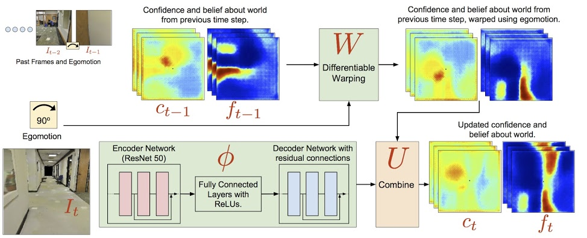
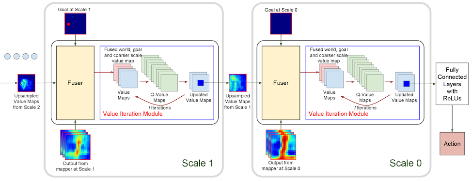

# Cognitive Mapping and Planning for Visual Navigation

An implementation of [Cognitive Mapping and Planning for Visual Navigation (S. Gupta *et al*, CVPR 2017)](https://arxiv.org/pdf/1702.03920.pdf) neural network architecture.

## Description

The paper introduced an interesting architecture where an explicit planning module using [Value Iteration Networks](https://arxiv.org/pdf/1602.02867.pdf) are used. The network consists of two major modules:

1. Mapper, which takes a first person visual input and maps it to a top-down 2D free space estimate.
   
2. Planner, which takes the output from the 2D free space estimate, runs value iteration and finally outputs an action.
   

More a more detailed implementation please refer to the paper.

## Implementation

### Model

`model.py` should be self contained. Other environment training files (such as `environment.py` or `expert.py` for expert data generation) are not expected to work without some modifications to the [DeepMind Lab](https://github.com/deepmind/lab) release.

### Differences from the original architecture

While the original architecture is designed to solve a navigation problem in a simulated in-door environment, this architecture is designed for testing in DeepMind's Lab navigation environment. As such, several modifications were made.

* The mapper architecture also keeps a copy of "rewards map" -- unlike the paper environment where the goal is clearly defined, the agent in Lab environment must explore first.
* The ResNet autoencoder has been replaced with a simple two-layer autoencoder.
* Sampling and VIN modules are implemented using RNN cells.

## References

* [Project website](https://sites.google.com/view/cognitive-mapping-and-planning/)
* [Reference code](https://github.com/tensorflow/models/tree/master/research/cognitive_mapping_and_planning)